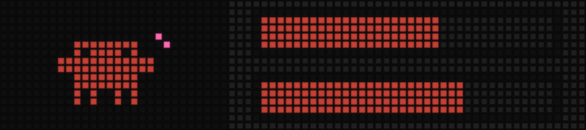
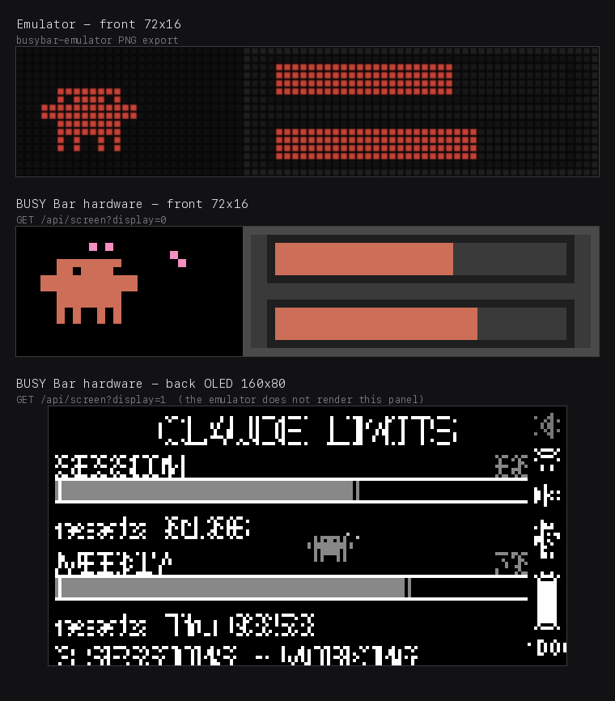

# busybar-limits

Live **Claude Code usage limits** on a [Flipper BUSY Bar](https://busy.bar) — the
5-hour session window and the weekly window as two bars on the 72×16 LED front,
a full dashboard on the 160×80 OLED back, and an animated Clawd mascot whose
mood tracks how close you are to the ceiling.



The front panel is only half of it — here is the same frame on the emulator and
on real hardware, including the back OLED the emulator does not render:



## Two ways to run it

| | daemon (this repo) | gallery app |
|---|---|---|
| Shape | `claude_limits/` package + launchd agent | one self-contained `app.py` |
| Runs | in the background, from login | in the foreground, while you watch it |
| Extras | Claude Code hook for live agent/session counts, device-mode gate | none — stdlib only |
| Get it | clone this repo, see below | [BUSY Bar app gallery](https://github.com/maxswinkels/busybar-apps/tree/main/apps/claude-limits) → `apps/claude-limits/app.py` |

If you just want the display, take the **gallery app** — it is a single file with
no install step. This repo is the fuller background daemon.

## What it shows

**Front (72×16 LED)** — the 8 px Clawd mascot on the left; on the right a gray
panel with the 5-hour session bar on top and the weekly bar below. Bars are
Claude orange-brown, turning dark red above 85%. Above 75% each bar also shows
its own time-to-reset inside the bar.

**Back (160×80 OLED)** — `CLAUDE LIMITS`, both percentages, both bars, both
reset times, and a live agent/session count from the hook.

**Degraded frames** — an expired token renders `AUTH EXPIRED - RUN claude`;
a usage snapshot older than 15 minutes renders `STALE 21m` rather than
silently showing old numbers as if they were current.

## Install

Requires macOS (Keychain-backed credentials) and Python 3.9+. No third-party
packages.

```bash
git clone https://github.com/rbhbokka/busybar-limits.git
cd busybar-limits

mkdir -p ~/.config/busybar-limits
cp config.example.json ~/.config/busybar-limits/config.json
# set device_url and api_token (Settings -> Network on the bar)
```

Smoke-test a single frame before installing anything:

```bash
python3 -m claude_limits.daemon --once --mock
```

Then install the launchd agent and the hook:

```bash
python3 scripts/install_daemon.py          # --dry-run to preview, --remove to undo
python3 scripts/install_hooks.py           # --remove to undo
```

`scripts/daemon_ctl.py on|off|status` pauses and resumes the agent without
reinstalling it; `off` also clears the bar immediately instead of waiting out
the element dead-man timeout.

## Configuration

`~/.config/busybar-limits/config.json`; only `device_url` and `api_token` are
required. See `config.example.json` for every key and its default.

| key | default | |
|---|---|---|
| `poll_seconds` | `180` | how often usage is refetched |
| `priority` | `20` | draw priority; low, so notifications win |
| `element_timeout_seconds` | `480` | dead-man window — a dead daemon clears the screen |
| `thresholds.high` | `85` | usage % above which everything turns dark red |
| `device_mode_gate_enabled` | `true` | only draw while the bar is in a custom/apps mode |

## Credentials

Usage comes from Anthropic's OAuth usage endpoint, authenticated with the token
Claude Code already stores in your Keychain (`Claude Code-credentials`). The
daemon refreshes that token when it is near expiry and writes the refreshed
value back, exactly as `claude` itself does.

> The gallery app takes the stricter line: it reads the token **read-only** and
> never writes it back, rendering `AUTH EXPIRED` instead of refreshing.

`/api/oauth/usage` is **undocumented** — it is what Claude Code itself calls,
hence the pinned `claude-code/2.1.220` User-Agent. It is the most likely thing
here to break in a future release.

## Layout

```
claude_limits/
  render.py       pure layout — colours, formats, the mascot, 21 animations
  daemon.py       the loop: slow data cadence, ~4 fps mascot re-push
  usage.py        the usage endpoint
  credentials.py  Keychain read + OAuth refresh
  agents.py       reads the hook's agents.json
  busybar.py      device HTTP client
  device_mode.py  WebSocket gate — only draw in custom/apps mode
  config.py       config loading
hook/             Claude Code hook that maintains agents.json
launchd/          launchd agent template
scripts/          install / control / dev push
```

Element ids, types, and `display` values in `render.py` are a firmware
contract: the bar rejects a redraw with HTTP 400 if an existing id changes its
type or display.

## License

MIT — see [LICENSE](LICENSE).
